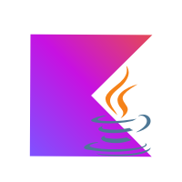
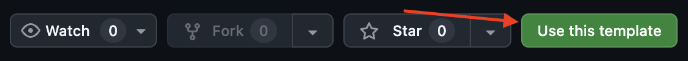

<p align="center">
  
</p>

👋 Привет!

Перед тобой тестовое задание на позицию стажёра Kotlin разработчика. Мы понимаем, что Kotlin может быть не так популярен как Java, так что можно сделать
тестовое здание и на Java, но предпочтительнее Kotlin.
Решение тестового задания должно находиться в приватном репозитории - чтобы все было по-честному и никто не смог воспользоваться результатами сделанной тобой работы.
Твой труд будет виден только тебе и нашей команде интервьюеров. Добавь их: LugaMuga, proshik.

Тебе не прийдется создавать каркас приложения самостоятельно - мы уже сделали это для тебя.

На локальной машине нужен установленный Git, Docker и Docker Compose, Java SDK, OpenIDE
Если у тебя их еще нет - тебе пригодятся следующие ссылки:

Docker
* https://docs.docker.com/engine/install/
* https://docs.docker.com/engine/install/linux-postinstall/ (дополнительные шаги для Linux)

Git
* https://git-scm.com/downloads

Java
* https://adoptium.net/temurin/releases/?version=21&os=any&arch=any

OpenIDE
* https://openide.ru/download/

## Начало разработки
Для того чтобы начать разрабатывать:
1. Авторизуйся в github.com и 
2. Нажми на кнопку Use this template title


После этого клонируй код своего репозитория на локальный компьютер и можно начинать работу. 
Часть кода уже написана - ее при необходимости можно смело менять, особенно если видишь в нем ошибки, но большую часть тебе прийдется написать самостоятельно.

## Предостережение❗
Пожалуйста, не использую ИИ для написания кода. Мы поймём, когда использовался ИИ, а когда ты писал(а) сам(а).
Нам важно оценить твои реальные навыки в разработке.

## Технологии и ограничения
### Ограничения по выполнению задания
* Язык разработки Java или Kotlin (только какой-то один)
* Сборка проходит под Java 21
* Используется framework Spring Boot версии 3.3 и выше
* Система сборки - Gradle версии 8.6 и выше
* Для работы с базой данных не используется ORM (пиши нативные SQL запросы через JdbcTemplate / NamedParameterJdbcTemplate)
* База данных - PostgreSQL 17 или выше
* Миграции пишутся с помощью библиотеки Liquibase и располагаются в `src/main/resources/liquibase`

### Java или Kotlin
Если будешь делать на Kotlin, то удали директории
* `src/main/java`
* `src/test/java`

Если всё же будещь делать на Java, удали директории:
* `src/main/kotlin`
* `src/test/kotlin`
и напиши новый класс Spring Boot приложения на Java.

### Docker
Docker и Docker compose необходимы для запуска PostgreSQL и Kafka в изолированных контейнерах.
В проекте уже есть docker-compose.yml который содержит описание необходимых сервисов.
Для запуска достаточно в директории проекта выполнить shell
```shell
docker compose up -d
```
Имей в виду, что без запущенного PostgreSQL сервис не запустится.

## Задание

Требуется реализовать простую систему бронирования номеров в отеле.
В этой системе базово предствалены всего 3 сущности: Гость, Номер, Бронь.

### API
##### Гости
* Добавить гостя
* Редактирование гостя

##### Номера
* Добавить номер
* Редактировать номер
* Удалить номер

##### Брони
* Поиск свободных номеров на дату и время
* Создание новой брони
* Редактирование брони
* Отмена брони

### Модель данных
У сущностей следующие свойства:
##### Гость
* Идентификатор
* Фамилия
* Имя
* Отчество
* Дата рождения
* Номер телефона

##### Номер
* Идентификатор
* Этаж
* Номер
* Количестов мест

##### Бронь
* Идентификатор
* Дата и время начала брони
* Дата и время окончания брони
* Гости
* Номер

## Что нужно сделать
1. Добавить модели для работы с базой данных
2. Реализовать DAO слой
3. Реализовать сервисный слой с бизнес логикой
4. Реализовать слой контроллеров c API
5. Документировать реализованное решение. Описать, почему сделано именно так, и какие видел(а) альтернативные варианты, плюсы и минусы.
   Поставленная задача решается множеством способов. В описании - по возможности напиши, сколько времени в часах у тебя заняла
   работа по этому тестовому заданию.
6. Сделать пулл-реквест из ветки, в которой разрабатывалось решение в main ветку - чтобы ревьюверу удобно было смотреть изменения

## Будет плюсом, если реализуешь (не обязательно все)
1. Unit тесты
2. Component тесты (запрос проходит от контроллера до БД и проверяет полностью логику)
3. Документацию через swagger-ui
4. Подключишь линтер
5. Отправка в Kafka следующих событий (не забудь раскомментировать сервисы в docker-compose.yml)
    * Создание/измение гостя
    * Создание/изменение брони
    * Создание/изменение/удаления номера
6. Добавишь endpoint для технических метрик и кастомные метрики (подумай какие могут быть полезны)

## При проверке мы оцениваем
1. Работоспособность решения
2. Полноту документирования API
3. Правильность работы решения с точки зрения здравого смысла
4. Обработку ошибок
5. Код решения, его качество
6. Наличие и качество автотестов
7. Реализацию дополнительных задач (при условии, что основное задание сделано верно)
8. Использовался ли ИИ при решении